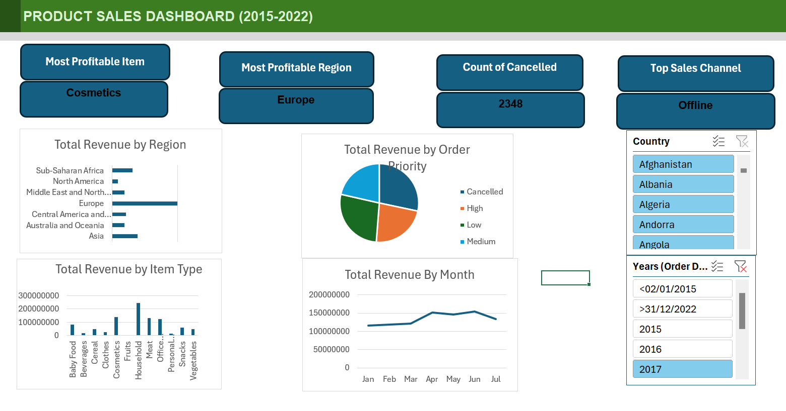

# Giwa and Sons Store Sales Dashboard

## Project Overview

The **Giwa and Sons Store Sales Dashboard** is an interactive and dynamic Excel-based business intelligence solution developed to analyze sales performance, revenue generation, and profitability across multiple product categories and regions.

This dashboard was designed to transform raw sales data into meaningful insights that support business decision-making. Using advanced Excel features such as **Pivot Tables, Pivot Charts, Slicers, and Dynamic Reporting**, the dashboard enables users to monitor sales trends and evaluate business performance efficiently.

---

## Objectives of the Dashboard

The main objectives of this project were to:

* Analyze total revenue generated across product categories.
* Identify the most profitable products and regions.
* Provide interactive filtering for enhanced user experience.
* Build a dynamic reporting system that automatically updates when new data is added.
* Present complex sales data in a visually appealing and easy-to-understand format.

---

## Key Features

### Dynamic Dashboard

The dashboard was built with dynamic Pivot Tables and Pivot Charts, ensuring that all visualizations automatically refresh whenever the dataset is updated.

### Interactive Slicers

Interactive slicers were implemented to allow users to filter and explore sales data quickly across different dimensions.

### Revenue Analysis

The dashboard provides detailed analysis of:

* Revenue by Region
* Revenue by Product Category
* Revenue Trends Over Time
* Profitability Analysis

### KPI Cards

Key Performance Indicators (KPIs) were added to highlight:

* Most Profitable Item
* Most Profitable Region
* Count of Cancelled Orders
* Most Profitable Sales Channel

### Data Visualization

Different chart types were used to improve data storytelling and insight generation, including:

* Bar Charts
* Pie Charts
* Line Charts
* Pivot Charts

---

## Tools & Skills Demonstrated

### Microsoft Excel

* Pivot Tables
* Pivot Charts
* Slicers
* Data Cleaning
* Data Aggregation
* Dashboard Design
* Dynamic Reporting
* KPI Development

### Analytical Skills

* Business Intelligence Reporting
* Revenue Analysis
* Trend Analysis
* Data Visualization
* Performance Monitoring
* Insight Generation

---

## Business Insights Generated

The dashboard enables stakeholders to:

* Identify high-performing product categories.
* Monitor revenue contribution across regions.
* Evaluate sales trends over time.
* Make data-driven business decisions.
* Quickly detect profitable business segments.

---

## Dashboard Functionality

One of the major strengths of this project is its **automation capability**.

Once new sales data is added to the source dataset:

1. The Pivot Tables automatically update after refresh.
2. Charts and visualizations dynamically adjust.
3. Slicers continue to provide interactive filtering.
4. KPIs reflect the latest business performance.

This makes the dashboard scalable and suitable for continuous business reporting.

---

## Project Highlights

* Developed a fully interactive sales dashboard in Excel.
* Built dynamic Pivot Table reports for automated analysis.
* Designed user-friendly visualizations for business stakeholders.
* Improved reporting efficiency through automation.
* Demonstrated strong analytical and dashboard design skills.

---

## About the Analyst

This project demonstrates practical expertise in:

* Data Analysis
* Business Intelligence
* Excel Dashboard Development
* Data Visualization
* Reporting Automation
* Decision Support Analytics

The dashboard reflects the ability to transform raw business data into actionable insights using industry-standard analytical techniques.

---

## Contact

For collaborations, internships, freelance projects, or data analyst opportunities:

* **Name:** Egabor Emmanuel
* **Email:** emmanuelegabor@gmail.com
* **Role:** Data Analyst
* **Skills:** Excel, Data Visualization, Dashboard Development, Business Intelligence, Data Cleaning, Reporting Automation

---

## Conclusion

The Giwa and Sons Store Sales Dashboard demonstrates how Excel can be leveraged as a powerful analytical and reporting tool to support strategic business decisions. Through dynamic reporting, interactive slicers, and insightful visualizations, the dashboard delivers a professional and scalable business intelligence solution.
